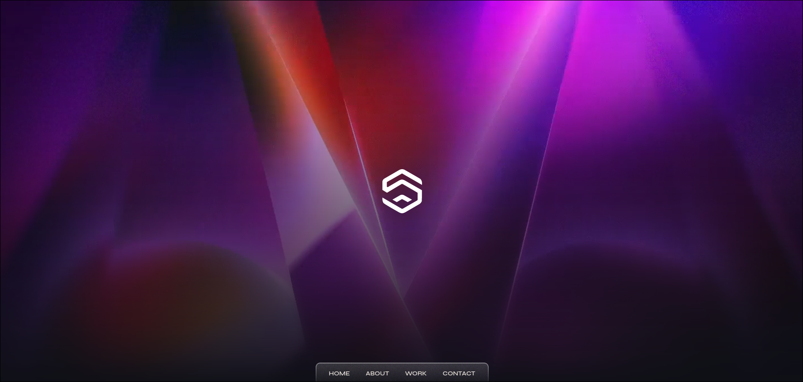
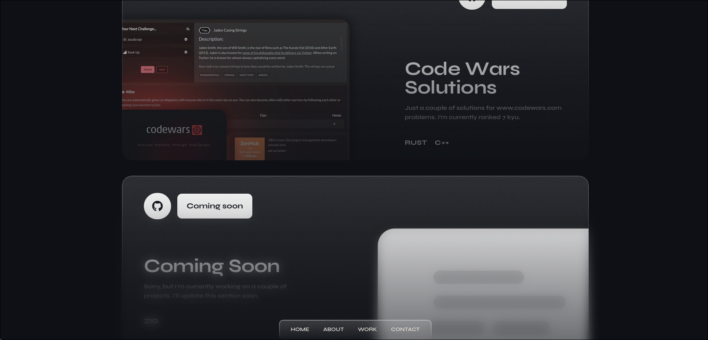
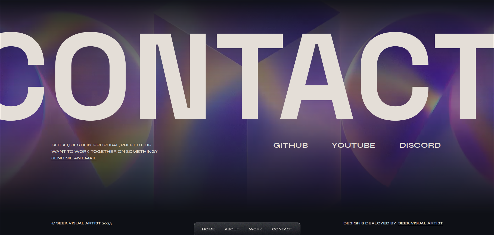

# Portfolio v5 

This is the fifth iteration of my portfolio website. It is built with Next.js, React and Tailwind CSS.

I wanted to try out a simplistic glassmorphism-like design.

It mainly presents my work as a visual artist and my skills as a web developer.

Check it out [here](https://www.seekvisualartist.com/)

---

## Showcase

<div>

<br>

<br>

</div>

---

## Prerequisites

- [Node.js](https://nodejs.org/en/) - 20.4.0 or higher
- That's it!

---

## Building

1. Clone the repository

```bash
git clone https://github.com/nuIIpointerexception/www.seekvisualartist.com/
```

2. Install dependencies

```bash
npm install
```

3. Run the development server

```bash
npm run dev
```

---

## Deployment 📦

Now you'll only need to deploy the app to your favorite hosting provider.
Personally I'd recommend [Vercel](https://vercel.com/) or [Netlify](https://www.netlify.com/).

---

## Tech used 🛠️

- [Next.js](https://nextjs.org/) - Bundler
- [React](https://reactjs.org/) - UI Library
- [Tailwind CSS](https://tailwindcss.com/) - CSS Framework
- [Framer Motion](https://www.framer.com/motion/) - Animation Library
- [GSAP](https://greensock.com/gsap/) - Animation Library

---

## License 📄

This project is licensed under the GNU GPLv3 License - see the [LICENSE](LICENSE) file for details.

---

## Goodbye 👋

If you liked this project, please consider giving it a ⭐!
